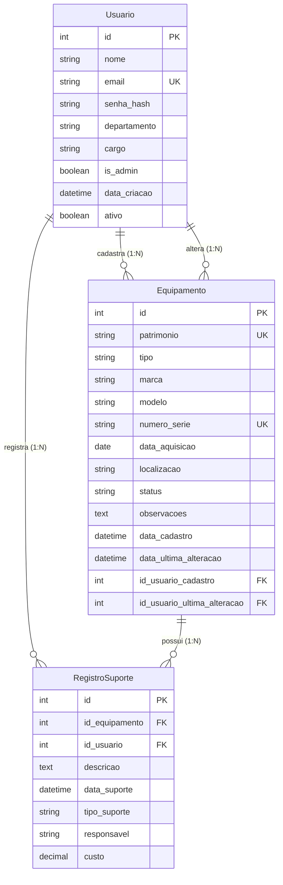

## Descrição do Diagrama ER

### Entidades

1. **Usuario**
   - Representa os usuários do sistema (administradores e usuários comuns)
   - Campos principais: nome, email, departamento, cargo, permissões

2. **Equipamento**
   - Representa os equipamentos de TI da organização
   - Campos principais: patrimônio, tipo, marca, modelo, localização, status
   - Relacionamentos: cadastrado por usuário, alterado por usuário

3. **RegistroSuporte**
   - Representa os registros de manutenção/suporte realizados nos equipamentos
   - Campos principais: descrição, data, tipo, responsável, custo

### Relacionamentos

- **Usuario → Equipamento (1:N)**
  - Um usuário pode cadastrar múltiplos equipamentos
  - Um usuário pode alterar múltiplos equipamentos
  - Chaves estrangeiras: `id_usuario_cadastro`, `id_usuario_ultima_alteracao`

- **Usuario → RegistroSuporte (1:N)**
  - Um usuário pode registrar múltiplos suportes
  - Chave estrangeira: `id_usuario`

- **Equipamento → RegistroSuporte (1:N)**
  - Um equipamento pode ter múltiplos registros de suporte
  - Chave estrangeira: `id_equipamento`

### Restrições de Integridade

- **Chaves Primárias**: id em todas as tabelas
- **Chaves Únicas**: email (Usuario), patrimonio e numero_serie (Equipamento)
- **Chaves Estrangeiras**: Todas referenciam ids válidos das tabelas pai
- **Obrigatórios**: Campos marcados como nullable=False
- **Enums**: StatusEquipamento e TipoSuporte definem valores permitidos

### Regras de Negócio

- Equipamentos podem ter status: Em Uso, Em Manutenção, Desativado, Descartado
- Tipos de suporte: Manutenção Corretiva, Preventiva, Atualização Software, Troca Peça, Outro
- Registros de suporte são obrigatoriamente vinculados a um equipamento
- Usuários podem ser administradores ou comuns